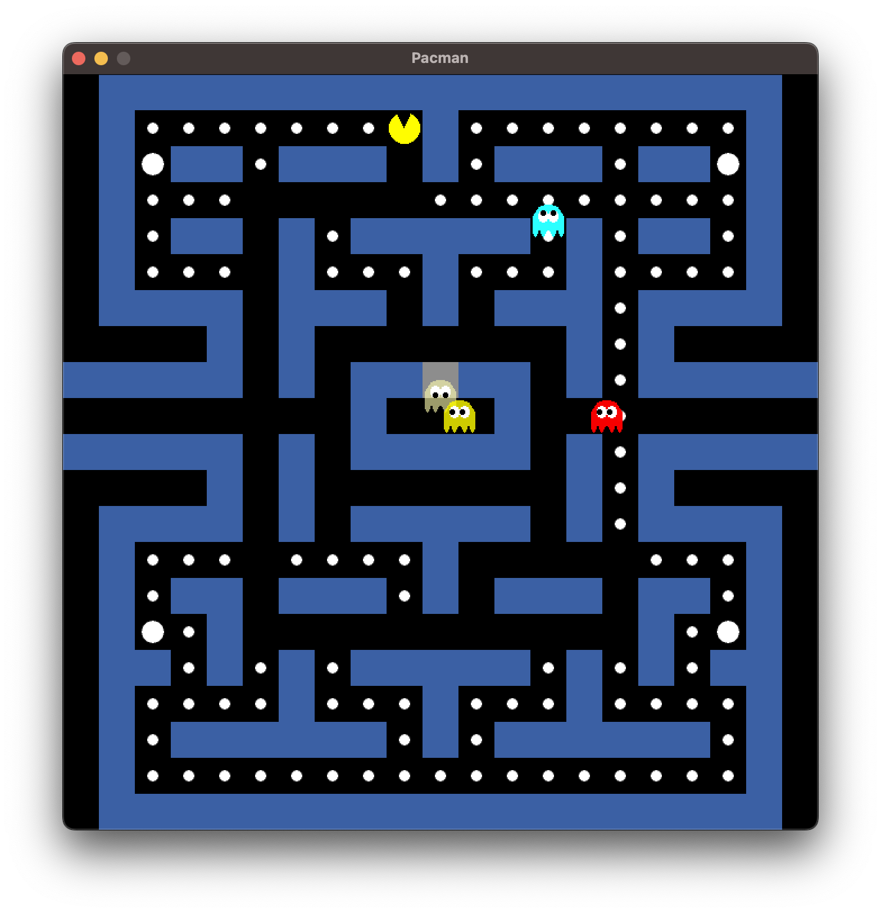

# Gopher Pacman

A Pacman clone written in Go using [Ebitengine](https://ebitengine.org/).

## Features

* Keyboard input
  * Arrow up or W: go up
  * Arrow down or S: go down
  * Arrow left or A: go left
  * Arrow right or D: go right
* Sound effect
  * Play a WAV file when game starts
  * Play two WAV files when Pacman eats a dot
  * Play a WAV file when Pacman eats a power pellet
  * Play a WAv file when Pacman eats a ghost
* Ghosts
  * Create the four ghosts when the game starts: Blinky, Pinky, Inky and Clyde
  * The ghosts moves randomly: every time it reaches a tile, the next tile is recalculated randomly

## Roadmap

* Implement more IA for ghots
* Scoreboard showing lives left, current score e current level